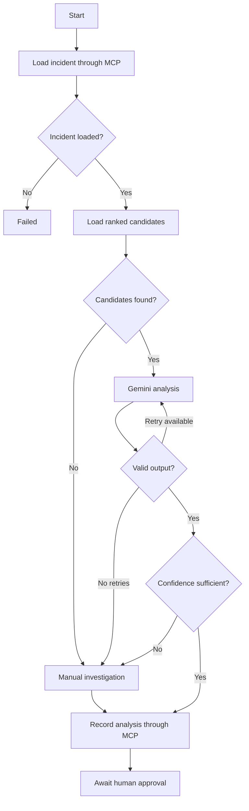

# Incident Analysis Agent

## Purpose

The Manifest-It incident analysis agent investigates an incident,
identifies the most likely responsible change, recommends a safe
remediation, and waits for human approval.

The agent does not execute remediation.

## Technology

The agent uses:

- LangGraph for workflow state, nodes and conditional routing.
- Gemini for structured incident analysis.
- MCP for audited access to operational data.
- PostgreSQL for incidents, changes, analyses and audit events.
- Zod for runtime validation of model output.

## Workflow

1. Receive an incident ID.
2. Load the incident through the `get_incident` MCP tool.
3. Load deterministic candidate rankings through the
   `get_ranked_candidate_changes` MCP tool.
4. Send the incident and ranked evidence to Gemini.
5. Validate Gemini's structured response.
6. Retry invalid model output up to two times.
7. Route weak or unsupported results to manual investigation.
8. Record the result using the `record_analysis_result` MCP tool.
9. Stop with human approval required.

## Workflow Diagram



## Agent State

The LangGraph state stores:

- `incidentId`: ID of the incident being investigated.
- `incident`: incident information returned by MCP.
- `candidates`: deterministically ranked candidate changes.
- `analysis`: validated Gemini analysis.
- `status`: current workflow stage.
- `error`: latest workflow error.
- `retryCount`: number of failed analysis attempts.
- `maxRetries`: maximum number of retries.

## Agent Statuses

The workflow can use the following statuses:

- `STARTED`
- `INCIDENT_LOADED`
- `CANDIDATES_LOADED`
- `ANALYSING`
- `RETRYING`
- `ANALYSIS_COMPLETE`
- `AWAITING_APPROVAL`
- `MANUAL_INVESTIGATION`
- `FAILED`

## Graph Nodes

### Load Incident

Calls the `get_incident` MCP tool using the supplied incident ID.

If the incident cannot be loaded, the workflow ends with `FAILED`.

### Load Candidates

Calls `get_ranked_candidate_changes` with a six-hour lookback
window.

The candidate scores are calculated by deterministic TypeScript
logic rather than by the language model.

### Analyse Incident

Sends the incident and ranked candidates to Gemini.

Gemini returns:

- Probable change ID
- Confidence score
- Reasoning summary
- Supporting evidence
- Recommended action
- Analysis status

Gemini may only select a change that exists in the candidate list.

### Manual Investigation

Creates a safe fallback result when:

- No candidate changes exist.
- Gemini output remains invalid after retries.
- Confidence is too low.
- The evidence is inconclusive.
- The recommendation is unsupported.

### Record Analysis

Calls the `record_analysis_result` MCP tool.

The MCP tool stores the analysis and updates the incident status in
PostgreSQL.

## Decision Rules

An analysis proceeds to approval only when:

- The probable change exists in the supplied candidate list.
- Confidence is at least `0.65`.
- The remediation type is supported.
- Execution explicitly requires human approval.
- The model does not claim the remediation was executed.

Supported remediation types are:

- `ROLLBACK`
- `CONFIGURATION_REVERT`
- `RESTART`

All other results are routed to `MANUAL_INVESTIGATION`.

## Safety Controls

### No Direct Database Access

The agent does not import PostgreSQL repositories or the shared
database connection.

All operational data is accessed through MCP tools.

### Candidate Validation

The probable change ID must exist in the ranked candidate list.

A fabricated or unknown change ID causes the model output to be
rejected.

### Structured Output

Gemini output is validated using a Zod schema.

Invalid responses trigger the retry branch.

### Retry Limit

The agent retries invalid model output a maximum of two times.

After retry exhaustion, the workflow falls back to manual
investigation rather than continuing indefinitely.

### Human Approval

Every recommendation must contain:

```json
{
  "execution": "HUMAN_APPROVAL_REQUIRED",
  "requires_approval": true
}
```

The TypeScript application checks these values independently of
Gemini.

The agent never performs a rollback, restart or configuration
change itself.

## Sample Analysis

For sample incident `INC-1042`, the agent identifies `CHG-201` as
the most likely cause.

Relevant evidence:

- `CHG-201` directly modified `order-service`.
- It occurred ten minutes before the incident.
- It occurred in the production environment.
- It was an application deployment.
- It received a deterministic raw score of `85`.

Expected recommendation:

```json
{
  "probable_change_id": "CHG-201",
  "confidence_score": 0.85,
  "recommended_action": {
    "type": "ROLLBACK",
    "resource": "order-service",
    "from_version": "v2.4.1",
    "to_version": "v2.4.0",
    "execution": "HUMAN_APPROVAL_REQUIRED",
    "requires_approval": true
  },
  "analysis_status": "AWAITING_APPROVAL"
}
```

## Running the Agent

Start PostgreSQL:

```powershell
docker compose --env-file .env -f deploy/docker-compose.yml up -d
```

Check PostgreSQL:

```powershell
docker compose --env-file .env -f deploy/docker-compose.yml ps
```

Build the project:

```powershell
npm run build
```

Run the agent:

```powershell
npm run agent -- INC-1042
```

## Testing

Run deterministic ranking tests:

```powershell
npm run test:ranking
```

Run focused agent tests:

```powershell
npm run test:agent
```

The agent unit tests do not call Gemini, MCP or PostgreSQL.

They test:

- Output-schema validation
- Incident routing
- Candidate routing
- Retry routing
- Confidence thresholds
- Manual fallback
- Human-approval enforcement

## Database Verification

Open PostgreSQL:

```powershell
docker compose --env-file .env -f deploy/docker-compose.yml exec postgres psql -U manifest_user -d manifest_db
```

Check the latest analysis:

```sql
SELECT
    incident_id,
    probable_change_id,
    confidence_score,
    analysis_status,
    recommended_action->>'type' AS action_type,
    created_at
FROM analysis_results
WHERE incident_id = 'INC-1042'
ORDER BY created_at DESC
LIMIT 1;
```

Check the incident:

```sql
SELECT
    id,
    status,
    updated_at
FROM incidents
WHERE id = 'INC-1042';
```

Check MCP audit events:

```sql
SELECT
    id,
    actor_type,
    actor_name,
    action,
    status,
    timestamp
FROM audit_events
WHERE incident_id = 'INC-1042'
ORDER BY timestamp DESC
LIMIT 15;
```

## Failure Handling

| Failure | Behaviour |
|---|---|
| Incident not found | End with `FAILED` |
| PostgreSQL or MCP unavailable | End with `FAILED` |
| No candidate changes | Manual investigation |
| Invalid Gemini output | Retry |
| Retry limit exceeded | Manual investigation |
| Low confidence | Manual investigation |
| Unsupported remediation | Manual investigation |
| Unsafe execution mode | Reject and retry |
| Recording failure | End with `FAILED` |