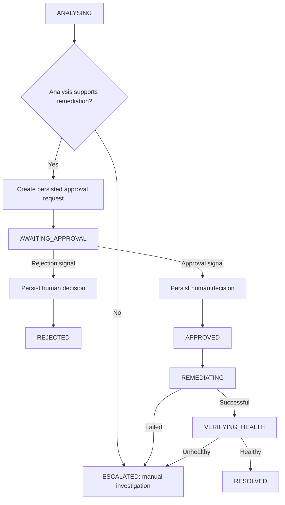

# Durable Incident Remediation with Temporal

## Current Scope

Temporal now owns the complete incident lifecycle through the CLI and HTTP API: analysis,
approval, simulated remediation, health verification, and a persisted final
status. LangGraph performs analysis, and all of its operational data access
continues to go through MCP. The worker's lifecycle activities persist
approval, remediation, verification, and audit records in PostgreSQL.

The HTTP analysis, approval, rejection, workflow-status, and audit endpoints
are documented in [api.md](api.md). The commands below exercise the same
Temporal loop through the CLI.

## Example Workflow

For `INC-1042`, the expected recommendation is a simulated rollback of
`order-service` from `v2.4.1` to `v2.4.0`.



Analysis activity failures are retried. If all attempts fail before a usable
analysis exists, the incident becomes `FAILED`. Failures after analysis
become `ESCALATED`. Rejection stops the workflow without executing remediation.

The workflow and PostgreSQL both store `VERIFYING_HEALTH` as a distinct phase
after migration `003`. The audit event records the exact workflow phase too.

## Database Upgrade

For either a fresh or existing database, apply all pending migrations before
starting the worker:

```powershell
npm run migrate
```

The migration runner tracks filenames and checksums and safely adopts the
existing initial schema. Docker no longer mounts raw migration SQL at startup;
both fresh containers and existing volumes use the same command above.
`npm run migrate:temporal` remains a compatibility alias for the full upgrade.

Migration `002_temporal_lifecycle.sql` adds:

- Unique workflow IDs on analyses and approval requests.
- Unique event keys for retry-safe lifecycle auditing.
- A remediation-attempt table with stored action, result, and health result.

Existing analyses and approval records keep null workflow IDs. No existing
records are removed.

## Running Locally

Stop any manually running Temporal dev server before using the normal Compose
stack: both use port 7233. Docker provides a separate history store; workflows
from your Windows CLI server are not automatically copied into it. Finish
pending workflows on the old server first, or use fresh incident IDs in Docker.

Start PostgreSQL and persistent Temporal, then seed the reference data:

```powershell
docker compose --env-file .env -f deploy/docker-compose.yml up -d --wait
npm run migrate
npm run seed
```

Set `DATABASE_URL`, `GOOGLE_API_KEY`, and the Temporal connection values in
`.env`. The analysis model is still the existing Gemini implementation.

Temporal listens at `localhost:7233`; its UI is at `http://localhost:8233`.
The `temporal-data` named volume persists workflow history separately from
PostgreSQL's `postgres-data` volume. This is a local development server, not a
production Temporal cluster. See [deployment.md](deployment.md) for Docker
verification and [database migrations](../database/migrations/README.md) for upgrades.

In another terminal, start the worker:

```powershell
npm run temporal:worker
```

Create the incident through the existing API if it has not already been
created. The seed command loads resources and changes, not incidents.

Start analysis, then inspect the recommendation and pending approval:

```powershell
npm run temporal:start -- INC-1042
npm run temporal:status -- INC-1042
```

Once the status is `AWAITING_APPROVAL`, approve and wait for the final result:

```powershell
npm run temporal:decide -- INC-1042 APPROVED evaluator@example.com "Reviewed deployment evidence" --wait
```

To reject instead:

```powershell
npm run temporal:decide -- INC-1042 REJECTED evaluator@example.com "Manual investigation needed" --wait
```

The status client displays the stored recommendation. The decision client
persists the human decision and signals its specific approval request.
An approver identity is required. Without
`--wait`, the command returns after signal submission; submission does not
claim that remediation has already finished.

The status command also supports `--wait`:

```powershell
npm run temporal:status -- INC-1042 --wait
```

It prints the snapshot, then waits for the result. While a workflow is
awaiting approval, a separate terminal must submit the decision.

## Development Compatibility

This lifecycle changes the command history of the original prototype.
Use fresh incident IDs for workflows started with the new implementation;
running workflows from the older implementation cannot safely replay this
new definition without a Temporal versioning migration.

For example, create `INC-1043` with the same service, environment, symptom,
and detection time as the sample, then run the commands with `INC-1043`.
The start client rejects reusing a workflow ID, including IDs that already
completed, and reports the existing workflow rather than starting another.

## Controlled Failure Scenarios

Choose the simulation when starting a fresh incident workflow:

```powershell
npm run temporal:start -- INC-1043 REMEDIATION_FAILURE
npm run temporal:start -- INC-1044 UNHEALTHY
```

Both still require approval. `REMEDIATION_FAILURE` records a failed simulated
attempt and escalates without health verification. `UNHEALTHY` records a
successful attempt followed by degraded simulated health and escalates.
The default scenario is `SUCCESS`.

## Signals and Queries

Signals:

- `approveRemediation`: accepts only an `APPROVED` decision.
- `rejectRemediation`: accepts only a `REJECTED` decision.
- `approvalDecision`: retained as the original generic signal name.

Every decision includes `approvalRequestId`, `decision`, `decidedBy`,
`decidedAt`, and an optional `comment`. The workflow accepts a decision only
while waiting for approval and only for the current request. Invalid,
mismatched, early, and subsequent signals do not trigger remediation. The
first valid decision wins. The CLI reports an already-recorded identical
decision and rejects conflicting decisions.

Queries:

- `workflowStatus`: current phase.
- `workflowSnapshot`: incident, workflow ID, analysis, approval request,
  recorded decision, remediation, health, errors, and timeline.
- `getRecommendation`: the analysis containing the recommendation.
- `getApprovalStatus`: the persisted human decision, if available.
- `getTimeline`: workflow phase transitions.

## Safety, Retries, and Idempotency

All database access and external calls run in activities. Workflow code uses
only deterministic Temporal operations. The API and CLI also persist human
decisions before signaling, reusing the activities' transactional repository.
Worker restart replays the history
and resumes the approval wait.

- Analysis: five-minute start-to-close timeout, twenty-minute overall
  activity timeout, three attempts, exponential backoff.
- Lifecycle persistence: one-minute start-to-close timeout, five-minute
  overall timeout, three attempts.
- Remediation and health: two-minute start-to-close timeout, ten-minute
  overall timeout, three attempts.
- Invalid approvals and mismatched remediation targets are non-retryable
  activity failures.

The analysis activity reuses the workflow's persisted result on retry. The
MCP recording tool does not replace that result or regress a final incident
status on a duplicate call. Approval creation and decision recording are
idempotent. A database row lock and unique workflow key protect the simulated
remediation; retries return the stored result and timestamp. Health retries
return the stored verification result.

Before simulating an action, the activity independently checks the durable
approval, workflow, approver, exact recommended action, changed resource,
resource type, and environment. A rollback needs distinct versions matching
the deployment version and stored `previous_version` metadata. A
configuration revert must target a configuration change.
No real Kubernetes or production mutation occurs.

Lifecycle state, human decisions, remediation results, and verification are
audited in the same transaction as their database changes. Sensitive keys
are redacted recursively. A database outage that also prevents recording
the final failure can leave the Temporal execution failed; it is not
reported as resolved.

## Verification

```powershell
npm run build
npm run test:ranking
npm run test:agent
npm run test:temporal
npm run test:api
```

Temporal tests start an isolated local Temporal server and run the real
workflow and lifecycle activities against embedded PostgreSQL (PGlite).
The analysis activity supplies deterministic data without Gemini calls.
They cover approval, rejection, unhealthy verification, remediation failure,
manual investigation, analysis retries, exhausted retries, remediation
retries, invalid signals, duplicate decisions, and worker restart.

The SDK may download a test-server executable on the first run. Docker and a
live LLM are not required for these tests. Embedded SQL tests verify migration
repeatability, durable approval enforcement, action/target matching,
idempotent records, and final database status. Production PostgreSQL
connection handling and cloud deployment require separate verification.
